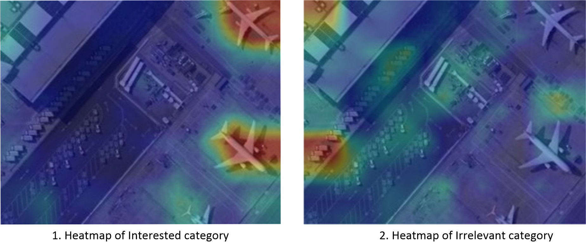

# Aerial Image Enhancement Algorithms for Object Detection with Human-In-The-Loop

## Introduction
Detecting small objects is challenging especially for aerial images. Human experience can potentially provide attentional priors as additional information to enhance small object detection performance.

This algorithm is the key module for our Human-In-The-Loop aerial detection systems, in which a classification network is trained to generate an activation heatmap on the input image for a user-specified target class. The heatmap can be projected onto the input image as an additional input channel that provides a soft semantic guidance to enhance the vision features in following detection work. 


## Algorithm Description — Human-in-the-Loop Aerial Object Detection System

This document describes the three core algorithmic modules of the proposed Human-in-the-Loop (HITL) aerial object detection system, corresponding to **Section 3.1**, **Section 3.2**, and **Section 3.3** of the paper.

The system targets small object detection in aerial imagery, where objects suffer from low resolution, limited contextual cues, and arbitrary orientation. The framework integrates algorithm-based image enhancement with human-guided feature enhancement.

---

The full pipeline consists of three modules:

| Module | Section | Role |
|---|---|---|
| Super-Resolution-Based Rotation-Aware Detection | 3.1 | Backbone: region proposal + super-resolution + rotation-aware detection |
| HITL Categorical Feature Enhancement | 3.2 | Generates a category-guided heatmap as an auxiliary input channel |
| HITL Regional Feature Enhancement | 3.3 | Generates a spatial attention map from human clicks |

Inputs flow as: **Raw aerial image → IDR (Interesting Detection Region) → SRI (Super-Resolution IDR) → HITL-enhanced features (EFM) → Rotation-aware detector → Detection results**.

---

### Super-Resolution-Based Rotation-Aware Detection Module

This module forms the backbone of the system and contains three sequential tasks: **region proposal generation**, **super-resolution enhancement**, and **rotation-aware detection**.

#### Region Proposal Generation

Aerial images are typically very large, making whole-image processing impractical. A uniform sliding-window crop generates too many background-only patches. We instead generate **Interesting Detection Regions (IDRs)**:

1. A base detector (YOLOv4) produces RoIs (Regions of Interest) on the original image.
2. Overlapping or adjacent RoIs are merged into larger IDRs using **Algorithm 1 (Region Merging)**.
3. The detector then operates only on IDRs, reducing background interference and computation.

**Algorithm 1 — Region Merging for IDR Generation**

```
Input : Set of candidate regions R = {r1, ..., rn},
        each ri = (x_tl, y_tl, x_br, y_br); adjacency threshold τ
Output: Merged region set R'

Initialize R' ← ∅
while R is not empty:
    select ri ∈ R
    initialize cluster C ← {ri}
    for each rj ∈ R, j ≠ i:
        d = ‖(x_tl_i, y_tl_i) − (x_tl_j, y_tl_j)‖₂
        if d < τ:
            merge rj into C
            remove rj from R
    compute bounding box b_C covering all regions in C
    add b_C to R'
    remove ri from R
return R'
```

#### Super-Resolution Enhancement

Each IDR is fed into a trained super-resolution network to reconstruct fine-grained details and strengthen visual cues for small objects.

- Network: an **ESRGAN-inspired** architecture.
- Features are extracted via continuously nested basic blocks.
- The image is upsampled by a factor of **4×**.
- A series of convolutional layers produces the final **Super-Resolution IDR (SRI)**.

#### Rotation-Aware Detection

The SRI (together with the HITL-enhanced features described in §3.2 and §3.3) is passed to a rotation-aware detector:

1. A **Region Proposal Network (RPN)** generates candidate regions.
2. An **RoI Transformer** learns rotated regions via an **RRoI learner**.
3. A **Position Sensitive RoI Align** mechanism converts rotated regions into horizontally aligned, rotation-invariant features.
4. A final **Detector Net** performs classification and bounding-box regression on the aligned features, providing precise localization for arbitrarily oriented objects.

---

### HITL Categorical Feature Enhancement Module

This module computes a category-guided heatmap (an **Enhanced Feature Map, EFM**) and attaches it as an additional channel to the SRI. It reduces pixel-level categorical ambiguity, mitigates misclassification risk, and lets the user specify the category of interest.

The workflow has three stages: **category feature extraction**, **category pattern construction**, and **category-guided feature enhancement**.

#### Category Feature Extraction

A simple CNN (ResNet-50 in the implementation) is trained on the aerial dataset. The discriminative signal is read off from the **Global Average Pooling (GAP)** layer placed between the last convolutional layer and the FC classifier.

**Classification Score (Eq. 1)**

For a category $c$, the classification score is the dot product between the GAP feature vector and the class-specific weight vector:

$$
S_c = \sum_k w_k^c \sum_{x,y} f_k(x, y) = \sum_{x,y}\sum_k w_k^c f_k(x, y)
$$

where:
- $f_k(x, y)$ — activation at spatial location $(x, y)$ on the $k$-th feature map of the last conv layer
- $\sum_{x,y} f_k(x, y)$ — GAP output for channel $k$
- $w_k^c$ — class-specific weight associated with channel $k$ for category $c$

**Procedure for SRIs:**
1. Compute classification scores for different positional regions of the SRI using Eq. 1.
2. Filter by a score threshold to retain regions with high categorical relevance.
3. Store the class activation maps of retained regions in a **feature pool** for category pattern construction.

#### Category Pattern Construction

A stable **category pattern** (class prototype) is computed as the mean vector of category features in the feature pool. Because score thresholding cannot eliminate all noise, **spectral clustering** is used to separate relevant from irrelevant features.

**Algorithm 2 — Spectral Clustering for Categorical Pattern Screening**

```
Input : Categorical patterns {p1, ..., pn}; number of clusters K = 2
Output: Clusters {C_rel, C_irr}

Step 1: Build similarity matrix W ∈ R^{n×n} between all pattern pairs.
Step 2: Build degree matrix D where D_ii = Σ_j W_ij.
Step 3: Compute normalized Laplacian
            L      = D − W
            L_sym  = D^(-1/2) · L · D^(-1/2)
Step 4: Eigen-decompose L_sym; take eigenvectors of the K smallest eigenvalues
            to form U ∈ R^{n×K}.
Step 5: Run K-means on the rows of U → partition into C_rel and C_irr.
```

The mean of features in $C_{rel}$ is adopted as the category pattern; $C_{irr}$ is discarded. Spectral clustering is chosen for its robustness to non-convex clusters, complex structures, and high-dimensional features.

#### Category-Guided Feature Enhancement

When a user specifies a category of interest (e.g., "aircraft"), the system generates a heatmap on the SRI that becomes an extra input channel.

1. The SRI is divided into sub-regions; a regional GAP feature is computed for each.
2. A **Class Activation Map (CAM)** is computed for each regional GAP feature:

**Class Activation Map (Eq. 2)**

$$
M_c(x, y) = \sum_k w_k^c \, f_k(x, y)
$$

$M_c(x,y)$ highlights the discriminative positions in the image that contribute most to the classification of category $c$.

3. The similarity between each regional CAM and the CAM of the selected category pattern is computed, producing the regional heatmap.
4. Regional heatmaps are merged into a single SRI-level heatmap representing relevance to the target class.
5. The heatmap is appended as a **fourth channel** alongside the SRI's RGB channels, providing categorical priors that improve detection performance for the selected class.

---

### HITL Regional Feature Enhancement Module

This module generates a **spatial attention** map from human-clicked key points and uses it to modulate the spatial features of the detection network. The mechanism is a **mixed-domain attention**, integrating spatial saliency and inter-channel relevance.

The pipeline has three steps.

#### Step 1 — Generating the Regional Attention Matrix

The user clicks one or more key locations $(x_i, y_i)$ on the SRI that are likely to contain target objects. For every pixel $(i, j)$ in the SRI, the **Chebyshev distance** to the nearest user-clicked point is computed:

**Equation 3**

$$
d = \max(|x_1 - x_2|,\ |y_1 - y_2|)
$$

This produces a **regional attention matrix $M$** that encodes the spatial relevance between each pixel and the human-indicated regions.

#### Step 2 — Calculating the Attention Weight Map

1. Apply both **average pooling** and **max pooling** to $M$, producing a $512 \times 512 \times 2$ feature map.
2. Apply a $1 \times 1 \times 2 \times 1$ convolution to fuse the two pooled channels into a single $512 \times 512$ feature map.
3. Pass the result through a fully connected layer + Softmax to obtain an attention weight map of size $w \times h$.
4. This attention map serves as a **spatial attention mask** over the $w \times h \times c$ feature map produced by the last convolutional layer of the detector.

#### Step 3 — Regional Feature Fusion

1. Compute the weighted summation of the detector's feature map using the attention weight map, producing a $1 \times c$-dimensional attention vector $a_e$.
2. $a_e$ encodes channel-wise compressed spatial attention.
3. Concatenate $a_e$ with the original feature vector $a$ to form an **enhanced feature**.
4. The enhanced feature is fed into the classification and localization heads of the detector for training or inference.

---

### Notation Summary

| Symbol | Meaning |
|---|---|
| **IDR** | Interesting Detection Region (a merged RoI cropped from the raw aerial image) |
| **SRI** | Super-Resolution IDR (output of the super-resolution network) |
| **EFM** | Enhanced Feature Map (the heatmap or attention map produced by §3.2 / §3.3) |
| **CAM** | Class Activation Map |
| **GAP** | Global Average Pooling |
| **RPN / RRoI** | Region Proposal Network / Rotated RoI |
| $f_k(x, y)$ | Activation at $(x, y)$ on the $k$-th feature map of the last conv layer |
| $w_k^c$ | Class-specific weight on channel $k$ for category $c$ |
| $S_c$ | Classification score for category $c$ |
| $M_c(x, y)$ | Class Activation Map for category $c$ |
| $M$ | Regional attention matrix (Chebyshev distance map) |
| $a$, $a_e$ | Original / enhanced feature vector |
| $\tau$ | Adjacency threshold for RoI merging |

## Bases and Dependency Projects
### Bases
Our implementation is based on two opensource projects:
- https://github.com/machrisaa/tensorflow-vgg (we build our feature extractor on it)
- https://github.com/zhoubolei/CAM (we build our class pattern learner on it)
Both of them are following MIT License (almost no restricts to use).

### Dependency Projects for Experiment Baselines
Though our full aerial detection system is not fully open, we have related open projects as baselines which can be used to reproduce the comparison to our full experiments for our system.
- https://github.com/xinntao/Real-ESRGAN (it can enhance the aerial image to super-resolution)
- https://github.com/dingjiansw101/AerialDetection (it can be adapt to our enhanced input as a backbone for detection)
- https://github.com/jazzsaxmafia/Weakly_detector (it can simulate human to click important regions)
- https://github.com/fanq15/FSOD-code (it can be used as the primary detection tool for cutting aerial image for meaningful sub-regions)

## Library Requirement and Install
### General Guide
Follow the install and usage documents for Bases and Related Projects in their sites.
* Install matlab
* Install C++ environment
* Install Python > 3.9
* Install required libraries for bases and depenency projects 

### Install VGG
* Install [tensorflow](https://github.com/tensorflow/tensorflow/blob/v1.0.0-rc1).
* Our code already contains the tensorflow-vgg and its models.

### Install CAM
* Our code already contains the pretrained models, so you don't need to download.
* Install [caffe](https://github.com/BVLC/caffe), compile the matcaffe (matlab wrapper for caffe), and make sure you could run the prediction example code classification.m.
* Clone the code from Github
* Run the demo code to generate the heatmap: in matlab terminal, 
```
demo
```
* Run the demo code to generate bounding boxes from the heatmap: in matlab terminal,
```
generate_bbox
```

## Data Set
Please refer to DOTA and COCO datasets. We also built a demo dataset, you can download it from https://zenodo.org/records/19692661

## Usage
### Enhance The Class Features
#### Train VGG
Actually we already trained the model, which can be downloaded in https://zenodo.org/records/19692661

If you want to retrain it, just two steps:
1. Prepare data
* Download dataset, including images and labels
* For train/ sub-folder, crop the objects as individule training data with prepare_image.m
* Modify the path of 'get_features.py' in vgg-tensorflow-modified/ sub-folder
* Train vgg or resnet model like in vgg-tensorflow-modified/ sub-folder
* Execute 
```
python vgg-tensorflow-modified/get_features.py
```
* Test
```
python vgg-tensorflow-modified/test_vgg.py
```
#### Fine-tune ROI
1. Prepare data
Put the training, validation and test data into ./data/ROI
2. Fine-tune
```
python finetune.py
```
#### Extract Class Patterns
0. Set the input and output paths in build_patterns.py
1. Extract Patterns (in form of classificatin score heatmaps)
```
python build_patterns.py
```
2. View Test Patterns, and see /predict/my or predict/heatmap
```
python test.py
```
#### Generate Enhanced Images
0. Set the input and output paths in stod_mycluster.py and stod.py
1. Enhance Images with Patterns
```
python stod_mycluster.py
python stod.py
```
2. See enhanced images like /predict/all or /predict/VHR

### Enhance Regional Features
1. Download and install Weakly_Detector
2. Train it with training dataset
3. Use it to simulate the human clicks on images
4. Calculate Enhanced regional matrices using bboxgenerator/dt_box 

### Full Detection with ROI Transformer
1. Download and install Backbone AerialDetection
2. Download and install FSOD, use it to select meaningful region in images (Optional)
3. Download and install Real-ESRGAN，use it to improve the resolution of the data (Optional)
4. Enhance the training, val, and test data with ESRGAN
5. Put the original and enhanced datesets into Backbone Project's mmdetection
6. Use Backbone Project's Data Processing tool to stack the datasets into unified one
7. Download and install AerialDetection, modify its input head to more channels
8. Copy the data to the input folder for AerialDetection, use it to train and test the results
9. Train and Test with Backbone

## Reference:
If you find this code useful, please consider citing:

**Human-in-the-Loop Collaborative Enhancement for Rotation-Aware Small Object Detection in Aerial Images**, under review for *The Visual Computer*
```
@inproceedings{Zhang2026HITL,
    author    = {Qiu, Xingye and Chen, chenhuan and Zhang, Li},
    title     = {Human-in-the-Loop Collaborative Enhancement for Rotation-Aware Small Object Detection in Aerial Images},
    booktitle = {Scientific Reports (Under Review)},
    year      = {2026},
    note    = {to appear},
}
```
## License:
The pre-trained models and the code are released for unrestricted use.
